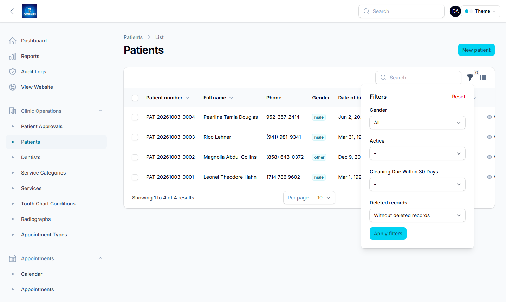
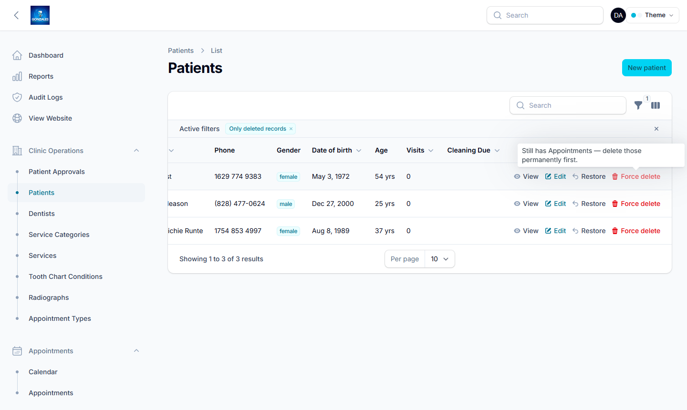
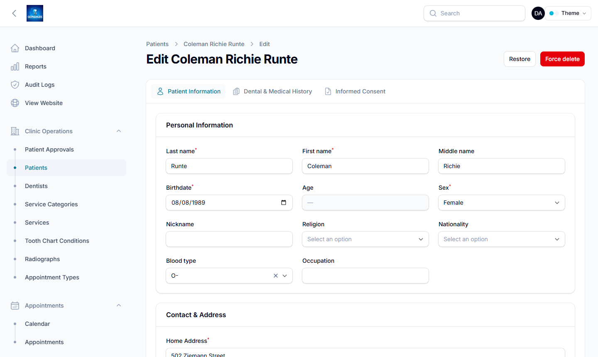
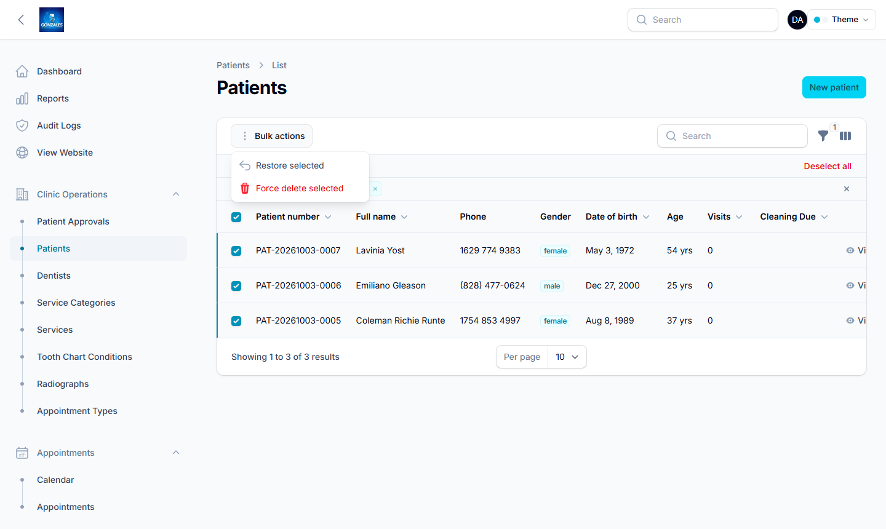

# Deleted Records (Trash)

Deleting a record in the admin panel doesn't erase it. It moves to the trash, where it's hidden from normal lists and searches but can still be restored. Only a super admin can erase a record for good, and only when nothing else still points to it.

The trash covers these six record types:

| Record | Admin page |
|---|---|
| Patients | Clinic Operations → Patients |
| Dentists | Clinic Operations → Dentists |
| Appointments | Appointments → Appointments |
| Dental Records | Medical Records → Dental Records |
| Prescriptions | Medical Records → Prescriptions |
| Invoices | Billing & Payments → Invoices |

Other records, such as users, services and equipment, are still deleted immediately and can't be restored.

## Who can do what

| Action | Who |
|---|---|
| Delete (move to trash) | Users with that record's delete permission, e.g. `delete_patient` |
| Restore | The same users who can delete it |
| Delete permanently | Super admins only |

With the default roles, admins can delete and restore all six record types. Receptionists can delete and restore appointments only. Dentists can't delete or restore any of them. You can change who can delete each record type under **Roles**.

## Finding deleted records

Open the list page, click the **filter** icon (funnel) above the table, and change **Deleted records**:

- **Without deleted records** (default): normal view
- **With deleted records**: everything, including the trash
- **Only deleted records**: just the trash

## Restoring a record

With deleted records showing, click **Restore** on the row. The record goes back into the normal lists exactly as it was.

You can also open a deleted record's edit page, which has **Restore** and **Force delete** buttons in the top right:

To restore several records at once, tick them, open **Bulk actions**, and choose **Restore selected**.

## Deleting permanently

**Force delete** removes the record from the database for good. It can't be undone.

The database also permanently deletes any records linked to the one you're erasing, including linked records that are already in the trash. To avoid losing medical or billing history by accident, **Force delete is greyed out while linked records still exist**. Hover over it to see what's in the way (in the screenshot above: *"Still has Appointments — delete those permanently first"*).

| Deleting permanently a… | Is blocked while it still has… |
|---|---|
| Patient | appointments, dental records, invoices, payments, prescriptions, certificates, medicine dispensings |
| Dentist | appointments, dental records, prescriptions |
| Invoice | payments |
| Dental record | a payment plan |
| Appointment, Prescription | nothing; can always be deleted permanently |

If you bulk force-delete a selection, the records that are still blocked are skipped. A message tells you how many were deleted and how many were skipped.

## For developers

- The logic lives in the trait [`app/Filament/Concerns/ManagesTrashedRecords.php`](../app/Filament/Concerns/ManagesTrashedRecords.php). Each of the six resources `use`s it and defines:
  - `trashPermissionKey()`: the permission suffix (`'patient'` → `delete_patient`)
  - `forceDeleteDependents()`: `table => foreign_key` pairs that block a permanent delete
- The app has no model policies. Filament's actions authorize through the resource's `get*AuthorizationResponse()` methods, not the `can*()` overrides, and fall back to *allow* when no policy exists. That's why the trait overrides the delete, restore and force-delete authorization responses itself.
- The blocking check queries the dependent tables directly with `DB::table()`. That way it also counts linked rows that are already soft-deleted, which the cascade would remove too.
- To add the trash to another resource, its model must use `SoftDeletes`. Then `use ManagesTrashedRecords;` in the resource, add `static::trashFilter()` to the filters, `...static::trashActions()` to the record actions and edit-page header actions, and `...static::trashBulkActions()` to the bulk actions.
- Tests: [`tests/Feature/Filament/TrashedRecordsTest.php`](../tests/Feature/Filament/TrashedRecordsTest.php).

*The screenshots were taken from a local copy filled with generated sample data. No real patient information is shown.*
